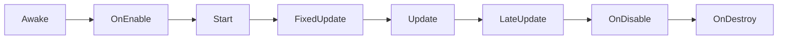

# Unity生命周期函数详解

## 一、生命周期函数概述

### 1.1 什么是生命周期函数？

Unity的生命周期函数是**脚本在游戏对象从创建到销毁的整个过程中，由Unity引擎自动调用的特殊函数**。这些函数构成了Unity脚本执行的"时间线"，开发者只需在这些函数中编写逻辑，无需手动调用。

> 💡 **核心原则**：生命周期函数由Unity引擎自动调用，开发者只需在合适时机编写逻辑，无需手动触发。

---

## 二、生命周期函数执行顺序

### 2.1 核心生命周期顺序



> ✅ **重要提示**：`FixedUpdate` → `Update` → `LateUpdate` 这个循环会在游戏运行期间**不断重复**，而`Awake`、`OnEnable`、`Start`只在**初始阶段**执行一次。

---

## 三、核心生命周期函数详解

### 3.1 `Awake()`

| 属性        | 说明                              |
| --------- | ------------------------------- |
| **触发时机**  | 脚本实例**被创建时**，无论脚本是否启用           |
| **执行次数**  | 整个生命周期**只执行一次**                 |
| **执行时机**  | 在**所有Start函数之前**，在**所有对象实例化之后** |
| **适用场景**  | 初始化重要组件引用、设置全局状态                |
| **不适用场景** | 依赖其他对象的初始化（如其他脚本的变量）            |

```csharp
void Awake() {
    // 1. 获取组件引用（比Start更早）
    _playerRigidbody = GetComponent<Rigidbody2D>();
    
    // 2. 设置全局状态（如游戏配置）
    GameSettings.Instance.Initialize();
    
    // 3. 初始化静态数据
    PlayerData.LoadFromSave();
}
```

> ⚠️ **关键提醒**：`Awake`在脚本创建时执行，**不依赖于游戏对象是否启用**。

---

### 3.2 `OnEnable()`

| 属性        | 说明                         |
| --------- | -------------------------- |
| **触发时机**  | **游戏对象被启用**时（包括场景加载、实例化对象） |
| **执行次数**  | **每次启用时执行**（可能多次）          |
| **适用场景**  | 重置状态、启用事件监听、初始化启用时需要的资源    |
| **不适用场景** | 初始化全局状态、依赖其他脚本的初始化         |

```csharp
void OnEnable() {
    // 1. 重置状态
    _isMoving = false;
    
    // 2. 启用事件监听
    EventSystem.Instance.Subscribe<HealthChangedEvent>(OnHealthChanged);
    
    // 3. 播放启用时的动画
    _animator.SetTrigger("Enable");
}
```

> 💡 **关键对比**：`Awake`只执行一次，`OnEnable`在每次启用时都会执行。

---

### 3.3 `Start()`

| 属性 | 说明 |
|------|------|
| **触发时机** | **第一次帧更新之前**，且**脚本启用** |
| **执行次数** | 整个生命周期**只执行一次** |
| **适用场景** | 需要依赖其他对象初始化的逻辑 |
| **不适用场景** | 初始化组件引用（应放在Awake中） |

```csharp
void Start() {
    // 1. 依赖其他脚本初始化
    _enemyManager = GameObject.FindObjectOfType<EnemyManager>();
    
    // 2. 设置初始状态
    _currentHealth = _maxHealth;
    
    // 3. 启动协程
    StartCoroutine(InitializeCoroutine());
}
```

> ⚠️ **重要提示**：`Start`在`Awake`之后、`Update`之前执行，**可以安全地使用其他脚本的公共变量**。

---

### 3.4 `FixedUpdate()`

| 属性 | 说明 |
|------|------|
| **触发时机** | **固定时间间隔**（默认0.02秒） |
| **执行次数** | **比Update更频繁**（受帧率影响较小） |
| **适用场景** | **物理计算**、刚体移动、碰撞检测 |
| **不适用场景** | 处理输入、UI更新、非物理逻辑 |

```csharp
void FixedUpdate() {
    // 1. 物理移动（必须用FixedUpdate）
    float horizontal = Input.GetAxis("Horizontal");
    _rb.velocity = new Vector2(horizontal * moveSpeed, _rb.velocity.y);
    
    // 2. 刚体力应用
    if (Input.GetButton("Fire1")) {
        _rb.AddForce(Vector2.right * fireForce);
    }
}
```

> 🌟 **关键优势**：`FixedUpdate`不受帧率波动影响，确保物理计算稳定。

---

### 3.5 `Update()`

| 属性 | 说明 |
|------|------|
| **触发时机** | **每一帧**（频率与游戏帧率相关） |
| **执行次数** | 每帧执行一次（通常60fps） |
| **适用场景** | **处理输入**、非物理逻辑、动画状态更新 |
| **不适用场景** | 物理计算、需要固定时间间隔的操作 |

```csharp
void Update() {
    // 1. 处理输入
    HandleInput();
    
    // 2. 更新动画状态
    UpdateAnimation();
    
    // 3. 检查游戏状态
    if (Input.GetKeyDown(KeyCode.Escape)) {
        PauseGame();
    }
}
```

> ⚠️ **重要提示**：`Update`**不要用于物理操作**，会导致帧率波动时行为不一致。

---

### 3.6 `LateUpdate()`

| 属性 | 说明 |
|------|------|
| **触发时机** | **Update执行完毕后** |
| **执行次数** | 每帧执行一次 |
| **适用场景** | **摄像机跟随**、确保目标物体已更新 |
| **不适用场景** | 一般逻辑处理 |

```csharp
void LateUpdate() {
    // 1. 摄像机跟随（确保角色移动完成）
    Vector3 targetPosition = _playerTransform.position;
    targetPosition.z = _cameraTransform.position.z;
    _cameraTransform.position = Vector3.SmoothDamp(
        _cameraTransform.position, 
        targetPosition, 
        ref _cameraVelocity, 
        cameraSmoothTime
    );
}
```

> 💡 **经典用例**：第三人称摄像机跟随角色，确保角色移动完成后摄像机才更新。

---

### 3.7 `OnDisable()`

| 属性 | 说明 |
|------|------|
| **触发时机** | **游戏对象被禁用**时（包括场景切换） |
| **执行次数** | 每次禁用时执行 |
| **适用场景** | 清理资源、取消事件订阅、保存状态 |
| **不适用场景** | 保存游戏（应使用`OnApplicationPause`） |

```csharp
void OnDisable() {
    // 1. 取消事件监听
    EventSystem.Instance.Unsubscribe<HealthChangedEvent>(OnHealthChanged);
    
    // 2. 保存当前状态
    SaveManager.SaveGameState(_currentHealth, _position);
    
    // 3. 重置状态
    _isMoving = false;
}
```

> ⚠️ **关键对比**：`OnDisable`与`OnEnable`对应，用于处理**禁用时的清理工作**。

---

### 3.8 `OnDestroy()`

| 属性 | 说明 |
|------|------|
| **触发时机** | **对象销毁前**（包括场景切换、`Destroy()`调用） |
| **执行次数** | 整个生命周期**只执行一次** |
| **适用场景** | **最终资源清理**、取消全局订阅 |
| **不适用场景** | 保存游戏状态（应使用`OnDisable`） |

```csharp
void OnDestroy() {
    // 1. 取消全局事件订阅
    EventSystem.Instance.UnsubscribeAll();
    
    // 2. 释放资源
    if (_projectilePool != null) {
        _projectilePool.Clear();
    }
    
    // 3. 通知其他系统
    GameManager.Instance.PlayerDied();
}
```

> ⚠️ **重要提示**：`OnDestroy`是对象生命周期的**最后阶段**，**不要在此处访问其他对象的引用**。

---

## 四、生命周期函数使用最佳实践

### 4.1 选择正确生命周期函数的指南

| 需求 | 推荐函数 | 为什么 |
|------|----------|--------|
| 初始化组件引用 | `Awake` | 比`Start`更早，确保引用可用 |
| 需要依赖其他对象 | `Start` | `Awake`可能在其他对象初始化前执行 |
| 处理输入 | `Update` | 每帧响应用户输入 |
| 物理移动/碰撞 | `FixedUpdate` | 确保物理计算稳定 |
| 摄像机跟随 | `LateUpdate` | 确保目标物体已移动完成 |
| 对象启用/禁用逻辑 | `OnEnable`/`OnDisable` | 处理状态切换 |
| 销毁时清理 | `OnDestroy` | 最后清理资源 |

### 4.2 常见错误及解决方案

| 错误 | 原因 | 解决方案 |
|------|------|----------|
| 在`Update`中使用`GetComponent` | 每帧都查找组件，性能低下 | 在`Awake`中获取并存储引用 |
| 物理操作放在`Update`中 | 帧率波动导致行为不一致 | 移动到`FixedUpdate` |
| 在`Awake`中初始化依赖其他对象的变量 | 其他对象可能还未初始化 | 移动到`Start` |
| 在`OnDestroy`中访问其他对象 | 其他对象可能已被销毁 | 使用`OnDisable`保存状态 |

---

## 五、生命周期函数应用示例

### 5.1 完整脚本示例

```csharp
using UnityEngine;

public class PlayerController : MonoBehaviour {
    // 公共变量（Inspector可见）
    [Header("Movement")]
    public float moveSpeed = 5f;
    public float jumpForce = 8f;
    
    // 私有变量
    private Rigidbody2D _rb;
    private Animator _animator;
    private bool _isGrounded;
    
    // 常量
    private const float GROUND_CHECK_DISTANCE = 0.1f;
    private const string GROUND_TAG = "Ground";

    // 1. 初始化组件（Awake）
    void Awake() {
        _rb = GetComponent<Rigidbody2D>();
        _animator = GetComponent<Animator>();
    }

    // 2. 初始化状态（Start）
    void Start() {
        _isGrounded = true; // 默认在地面
    }

    // 3. 处理输入（Update）
    void Update() {
        HandleInput();
        CheckGround();
    }

    // 4. 物理移动（FixedUpdate）
    void FixedUpdate() {
        MovePlayer();
    }

    // 5. 摄像机跟随（LateUpdate）
    void LateUpdate() {
        FollowCamera();
    }

    // 6. 处理输入
    private void HandleInput() {
        if (Input.GetButtonDown("Jump") && _isGrounded) {
            Jump();
        }
    }

    // 7. 移动玩家
    private void MovePlayer() {
        float horizontal = Input.GetAxis("Horizontal");
        _rb.velocity = new Vector2(horizontal * moveSpeed, _rb.velocity.y);
    }

    // 8. 跳跃
    private void Jump() {
        _rb.velocity = new Vector2(_rb.velocity.x, jumpForce);
        _isGrounded = false;
    }

    // 9. 检查地面
    private void CheckGround() {
        Collider2D groundCheck = Physics2D.OverlapCircle(
            transform.position, 
            GROUND_CHECK_DISTANCE, 
            LayerMask.GetMask("Ground")
        );
        
        _isGrounded = (groundCheck != null);
    }

    // 10. 摄像机跟随
    private void FollowCamera() {
        Vector3 targetPosition = transform.position;
        targetPosition.z = Camera.main.transform.position.z;
        Camera.main.transform.position = Vector3.Lerp(
            Camera.main.transform.position, 
            targetPosition, 
            0.1f
        );
    }
}
```

---

## 六、总结：生命周期函数黄金法则

1. **`Awake` > `Start` > `Update` > `LateUpdate`**：记住这个执行顺序
2. **物理操作 → `FixedUpdate`**，**输入处理 → `Update`**
3. **组件引用 → `Awake`**，**状态初始化 → `Start`**
4. **启用/禁用逻辑 → `OnEnable`/`OnDisable`**
5. **销毁清理 → `OnDestroy`**
6. **避免在`Update`中查找组件**（性能低下）
7. **避免在`Awake`中使用其他脚本的变量**（可能未初始化）

> ✨ **终极提示**：  
> "生命周期函数不是选择题，而是**正确时机**的必答题。  
> 用对了，代码流畅如丝；用错了，bug满天飞！"

---

**附：生命周期函数速查表**

| 函数 | 触发时机 | 适用场景 | 执行次数 |
|------|----------|----------|----------|
| `Awake` | 脚本创建时 | 组件引用初始化 | 1次 |
| `OnEnable` | 对象启用时 | 状态重置、事件订阅 | 多次 |
| `Start` | 第一次Update前 | 依赖其他对象的初始化 | 1次 |
| `FixedUpdate` | 固定时间间隔 | 物理计算、刚体移动 | 每帧多次 |
| `Update` | 每帧 | 输入处理、非物理逻辑 | 每帧 |
| `LateUpdate` | Update后 | 摄像机跟随 | 每帧 |
| `OnDisable` | 对象禁用时 | 清理、保存状态 | 多次 |
| `OnDestroy` | 对象销毁前 | 最终资源清理 | 1次 |

> 本指南适用于Unity 2020-2023版本，适用于所有2D/3D项目开发。  
> **记住：理解生命周期，是写好Unity脚本的第一步！** 🚀