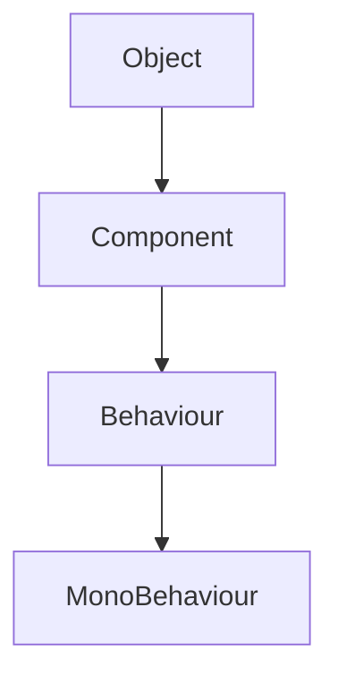
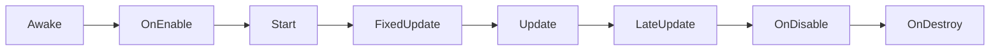

# Unity MonoBehaviour核心内容详解

## 一、MonoBehaviour定义与作用

### 1.1 什么是MonoBehaviour？

**MonoBehaviour是Unity中所有脚本的基类**，它定义了Unity脚本的运行框架和生命周期。当您在Unity中创建C#脚本时，它会自动继承MonoBehaviour类，使脚本能够作为组件附加到游戏对象上。

> 💡 **核心价值**：MonoBehaviour是Unity脚本系统的核心，它使脚本能够：
> - 作为组件附加到GameObject
> - 接收Unity引擎的生命周期事件
> - 与Unity的物理、渲染和输入系统交互

---

## 二、MonoBehaviour的继承结构

### 2.1 继承层次



- **Object**：Unity所有类的基类
- **Component**：Unity中所有组件的基类
- **Behaviour**：包含生命周期函数的组件基类
- **MonoBehaviour**：Unity脚本的最终基类

> ⚠️ **重要提示**：MonoBehaviour**不是普通类**，它是**组件**，必须挂载到GameObject上才能生效，**不能通过`new`创建实例**。

---

## 三、MonoBehaviour的关键特性

### 3.1 必须继承MonoBehaviour

```csharp
// ✅ 正确：继承MonoBehaviour
public class PlayerController : MonoBehaviour { }

// ❌ 错误：未继承MonoBehaviour
public class PlayerManager { } // 无法挂载到GameObject
```

> 💡 **为什么**：Unity引擎通过MonoBehaviour类识别脚本组件，只有继承了MonoBehaviour的类才能作为组件附加到GameObject。

---

### 3.2 不能使用`new`创建实例

```csharp
// ❌ 错误：不能new
PlayerController controller = new PlayerController(); 

// ✅ 正确：通过AddComponent挂载
GameObject player = new GameObject("Player");
PlayerController controller = player.AddComponent<PlayerController>();
```

> ⚠️ **错误提示**：`You are trying to instantiate a MonoBehaviour using 'new'. Don't use 'new' on MonoBehaviour derivatives.`

---

### 3.3 不要编写构造函数

```csharp
// ❌ 错误：不要写构造函数
public PlayerController() {
    // 无意义，因为无法通过new创建
}

// ✅ 正确：使用Awake/Start初始化
void Awake() {
    // 初始化
}
```

> 💡 **为什么**：MonoBehaviour实例由Unity创建和管理，构造函数不会被调用。

---

### 3.4 可以挂载多个脚本实例

```csharp
// ✅ 默认可以挂载多个
public class PlayerController : MonoBehaviour { }

// ❌ 禁止挂载多个
[DisallowMultipleComponent]
public class PlayerController : MonoBehaviour { }
```

> ⚠️ **重要**：默认情况下，Unity允许在同一个GameObject上挂载多个相同脚本实例，但可以通过`[DisallowMultipleComponent]`特性禁止。

---

## 四、MonoBehaviour的关键属性

### 4.1 常用属性

| 属性 | 类型 | 说明 | 示例 |
|------|------|------|------|
| `this.enabled` | `bool` | 脚本组件是否启用 | `this.enabled = false;` |
| `this.gameObject` | `GameObject` | 脚本挂载的游戏对象 | `print(this.gameObject.name);` |
| `this.transform` | `Transform` | 脚本挂载对象的Transform | `print(this.transform.position);` |
| `this.tag` | `string` | 游戏对象的标签 | `if (this.tag == "Player") { ... }` |
| `this.name` | `string` | 游戏对象的名称 | `print(this.name);` |

> 💡 **重要提示**：`this.transform`等价于`this.gameObject.transform`，是Unity中**最常用的属性**。

---

## 五、MonoBehaviour的生命周期函数

### 5.1 核心生命周期函数



| 函数 | 触发时机 | 适用场景 | 重要提示 |
|------|----------|----------|----------|
| `Awake()` | 脚本实例创建时 | 组件引用初始化 | **最先执行**，不依赖于对象启用 |
| `OnEnable()` | 对象启用时 | 重置状态、启用事件监听 | 对象启用时执行，可能多次 |
| `Start()` | 第一次Update前 | 依赖其他对象的初始化 | **比Awake晚**，**比Update早** |
| `FixedUpdate()` | 固定时间间隔 | 物理计算、刚体移动 | **物理操作必须用此** |
| `Update()` | 每帧 | 输入处理、非物理逻辑 | **每帧执行**，受帧率影响 |
| `LateUpdate()` | Update后 | 摄像机跟随 | 确保目标物体已更新 |
| `OnDisable()` | 对象禁用时 | 清理资源、取消订阅 | 与OnEnable对应 |
| `OnDestroy()` | 对象销毁前 | 最终资源清理 | **最后执行**，不能访问其他对象 |

> 🌟 **关键区别**：`FixedUpdate`用于物理计算，`Update`用于非物理逻辑。

---

## 六、MonoBehaviour的常用方法

### 6.1 获取组件与对象

| 方法 | 作用 | 示例 |
|------|------|------|
| `GetComponent<T>()` | 获取自身挂载的组件 | `Rigidbody rb = GetComponent<Rigidbody>();` |
| `GetComponents<T>()` | 获取自身挂载的所有组件 | `Rigidbody[] rbs = GetComponents<Rigidbody>();` |
| `GetComponentInChildren<T>()` | 获取子对象挂载的组件 | `Transform child = GetComponentInChildren<Transform>();` |
| `GetComponentInParent<T>()` | 获取父对象挂载的组件 | `Transform parent = GetComponentInParent<Transform>();` |
| `FindObjectOfType<T>()` | 全局查找对象 | `PlayerController player = FindObjectOfType<PlayerController>();` |

> 💡 **最佳实践**：**避免在Update中使用这些方法**，应在Awake或Start中获取并存储引用。

---

### 6.2 协程管理

| 方法 | 作用 | 示例 |
|------|------|------|
| `StartCoroutine(IEnumerator routine)` | 启动协程 | `StartCoroutine(ExampleCoroutine());` |
| `StopCoroutine(IEnumerator routine)` | 停止特定协程 | `StopCoroutine(exampleCoroutine);` |
| `StopAllCoroutines()` | 停止所有协程 | `StopAllCoroutines();` |

```csharp
IEnumerator ExampleCoroutine() {
    yield return new WaitForSeconds(2f);
    Debug.Log("Waited 2 seconds!");
}
```

> 💡 **协程优势**：比Invoke更强大，支持暂停、恢复和嵌套执行，避免回调地狱。

---

### 6.3 事件处理

| 方法 | 触发时机 | 适用场景 |
|------|----------|----------|
| `OnCollisionEnter(Collision collision)` | 发生物理碰撞时 | 检测碰撞 |
| `OnCollisionStay(Collision collision)` | 碰撞持续时 | 持续处理碰撞 |
| `OnCollisionExit(Collision collision)` | 碰撞结束时 | 清理碰撞 |
| `OnTriggerEnter(Collider other)` | 触发器进入时 | 检测触发器 |
| `OnBecameVisible()` | 渲染器进入摄像机视图 | 优化渲染 |
| `OnBecameInvisible()` | 渲染器离开摄像机视图 | 优化渲染 |

> ⚠️ **重要提示**：使用`OnCollisionEnter`需要确保碰撞体的`isTrigger`为false，使用`OnTriggerEnter`需要设置为true。

---

## 七、MonoBehaviour的常见错误与解决方案

### 7.1 常见错误列表

| 错误 | 原因 | 解决方案 |
|------|------|----------|
| `The script has no MonoBehaviour` | 类名与文件名不一致 | 重命名文件为`ClassName.cs` |
| `Cannot instantiate MonoBehaviour` | 试图用`new`创建脚本 | 改用`AddComponent`挂载 |
| `NullReferenceException` | 未在Awake/Start中初始化组件 | 在Awake中获取组件引用 |
| 物理操作放在Update中 | 帧率波动导致行为不一致 | 移动到FixedUpdate中 |
| 在Update中使用GetComponent | 每帧查找组件，性能低下 | 在Awake中获取并存储引用 |

---

### 7.2 最佳实践总结

| 场景 | 推荐方法 | 为什么 |
|------|----------|--------|
| 初始化组件 | `Awake()` | 比Start更早，确保引用可用 |
| 依赖其他对象 | `Start()` | `Awake`可能在其他对象初始化前执行 |
| 处理输入 | `Update()` | 每帧响应用户输入 |
| 物理移动 | `FixedUpdate()` | 确保物理计算稳定 |
| 摄像机跟随 | `LateUpdate()` | 确保目标物体已移动完成 |
| 对象启用/禁用 | `OnEnable`/`OnDisable` | 处理状态切换 |
| 销毁清理 | `OnDestroy()` | 最后清理资源 |

---

## 八、完整示例：PlayerController脚本

```csharp
using UnityEngine;

// 必须继承MonoBehaviour
public class PlayerController : MonoBehaviour
{
    // 公共变量（Inspector可见）
    [Header("Movement Settings")]
    [Tooltip("玩家移动速度")]
    [Range(1f, 10f)]
    public float moveSpeed = 5f;
    
    [Header("Jump Settings")]
    [Tooltip("玩家跳跃力")]
    public float jumpForce = 8f;
    
    // 私有变量（通过SerializeField显示在Inspector中）
    [SerializeField] private Rigidbody2D _rb;
    [SerializeField] private Animator _animator;
    [SerializeField] private bool _isGrounded = true;
    
    // 常量
    private const float GROUND_CHECK_DISTANCE = 0.1f;
    private const string GROUND_TAG = "Ground";

    // 1. 初始化组件（Awake）
    void Awake()
    {
        // 获取组件（比Start更早）
        _rb = GetComponent<Rigidbody2D>();
        _animator = GetComponent<Animator>();
        
        if (_rb == null)
        {
            Debug.LogError("PlayerController需要Rigidbody2D组件！");
        }
    }

    // 2. 初始化状态（Start）
    void Start()
    {
        _isGrounded = true;
    }

    // 3. 处理输入（Update）
    void Update()
    {
        HandleInput();
        CheckGround();
    }

    // 4. 物理移动（FixedUpdate）
    void FixedUpdate()
    {
        MovePlayer();
    }

    // 5. 摄像机跟随（LateUpdate）
    void LateUpdate()
    {
        FollowCamera();
    }

    // 6. 处理输入
    private void HandleInput()
    {
        if (Input.GetButtonDown("Jump") && _isGrounded)
        {
            Jump();
        }
    }

    // 7. 移动玩家
    private void MovePlayer()
    {
        float horizontal = Input.GetAxis("Horizontal");
        _rb.velocity = new Vector2(horizontal * moveSpeed, _rb.velocity.y);
    }

    // 8. 跳跃
    private void Jump()
    {
        _rb.velocity = new Vector2(_rb.velocity.x, jumpForce);
        _isGrounded = false;
    }

    // 9. 检查地面
    private void CheckGround()
    {
        Collider2D groundCheck = Physics2D.OverlapCircle(
            transform.position, 
            GROUND_CHECK_DISTANCE, 
            LayerMask.GetMask(GROUND_TAG)
        );
        
        _isGrounded = (groundCheck != null);
    }

    // 10. 摄像机跟随
    private void FollowCamera()
    {
        Vector3 targetPosition = transform.position;
        targetPosition.z = Camera.main.transform.position.z;
        Camera.main.transform.position = Vector3.Lerp(
            Camera.main.transform.position, 
            targetPosition, 
            0.1f
        );
    }
}
```

---

## 九、总结：MonoBehaviour黄金法则

1. **必须继承MonoBehaviour**才能作为组件挂载
2. **不能使用`new`创建实例**，必须通过AddComponent挂载
3. **不要编写构造函数**，使用Awake/Start初始化
4. **物理操作 → FixedUpdate**，**输入处理 → Update**
5. **组件引用 → Awake**，**状态初始化 → Start**
6. **避免在Update中使用GetComponent**（性能低下）
7. **生命周期函数顺序**：Awake → OnEnable → Start → FixedUpdate → Update → LateUpdate → OnDisable → OnDestroy

> ✨ **终极提示**：  
> "MonoBehaviour不是普通类，它是Unity脚本的'心脏'。  
> 理解它，你就能理解Unity脚本系统的核心；  
> 用好它，你的代码将优雅而高效！"

---

**附：MonoBehaviour核心要点速查表**

| 特点 | 说明 |
|------|------|
| **基类** | 所有Unity脚本的基类 |
| **继承结构** | Object → Component → Behaviour → MonoBehaviour |
| **实例化** | 不能用`new`，必须挂载到GameObject |
| **构造函数** | 不要编写，无意义 |
| **生命周期** | Awake → OnEnable → Start → FixedUpdate → Update → LateUpdate → OnDisable → OnDestroy |
| **关键属性** | `enabled`, `gameObject`, `transform`, `tag`, `name` |
| **关键方法** | `GetComponent`, `StartCoroutine`, `OnCollisionEnter` |
| **最佳实践** | 组件引用在Awake中获取，物理操作在FixedUpdate中 |

> 本指南适用于Unity 2020-2023版本，适用于所有2D/3D项目开发。  
> **记住：掌握MonoBehaviour，是成为Unity开发者的基石！** 🚀